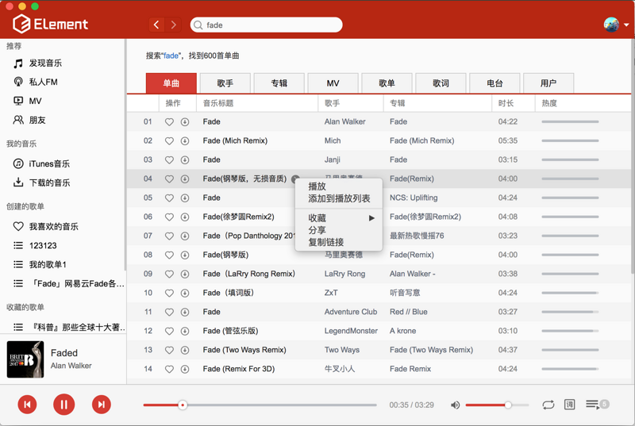
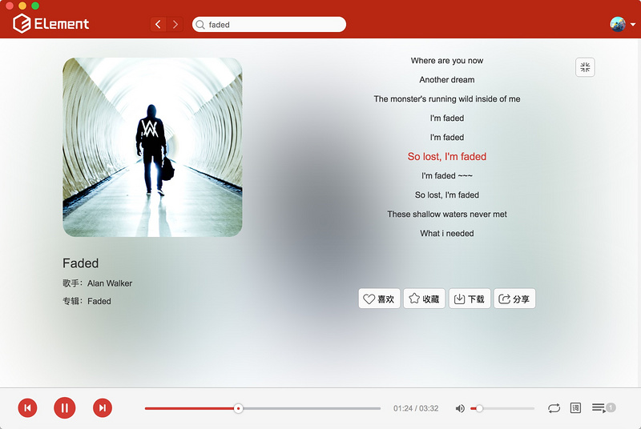

# eLyric

> 基于的`vue-electron-music`制作lrc歌词制作工具


## 图片预览




## 安装运行（Build Setup）

> 确保项目正常运行，请将你的node版本升级为7.0+以上，低版本node没有测试过。

``` bash
# 安装依赖
npm install
# 启动本地服务 localhost:9080
npm run dev
# 打包成本地应用
npm run build
# 开启控制台
Ctrl + Shift + i
```

