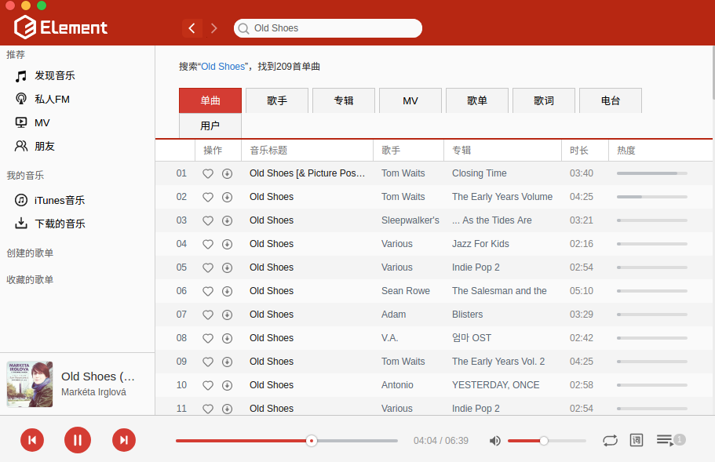

# eLyric

> 基于的`vue-electron-music`制作lrc歌词制作工具

## 制作歌词

### 制作流程
+ 主界面搜索歌曲播放
+ 选择`制作歌词`按钮,打开纯文本歌词文件(会自动去除空行)
+ 使用`↑`快捷键给文本歌词加时间标签
+ 回车结束制作(当文本歌词到最后一行时会自动结束制作)
+ 保存歌词文件(保存完成会自动预览)

###　快捷键
+ `←` : 快退2秒
+ `↑`: 歌词向上往一行
+ `→` : 快进2秒
+ `spcae(空格)` : 暂停/播放
+ `enter(回车)` : 结束歌词制作

## 图片预览



## 安装运行（Build Setup）

> 确保项目正常运行，请将你的node版本升级为7.0+以上，低版本node没有测试过。

``` bash
# 安装依赖
npm install
# 启动本地服务 localhost:9080
npm run dev
# 打包成本地应用
npm run build
# 开启控制台
Ctrl + Shift + i
```

